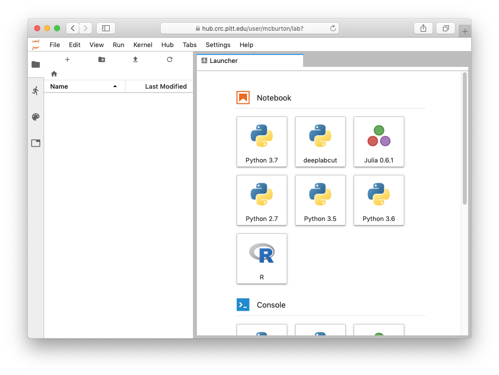
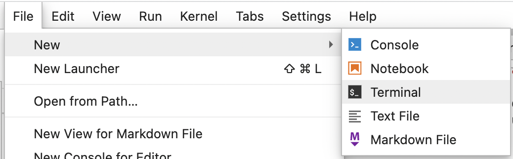
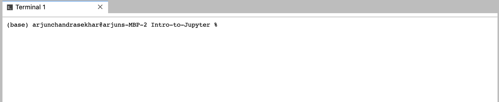
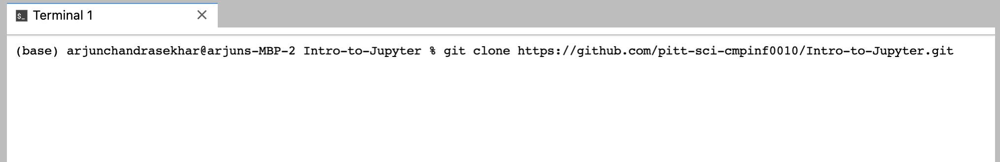
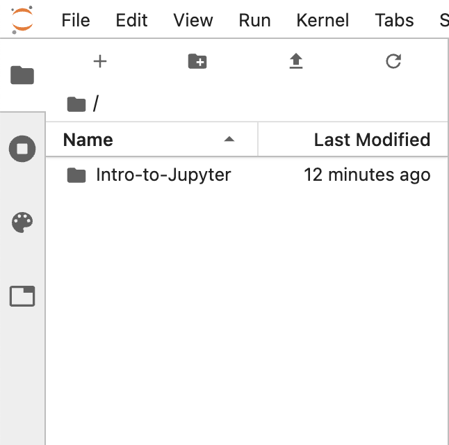
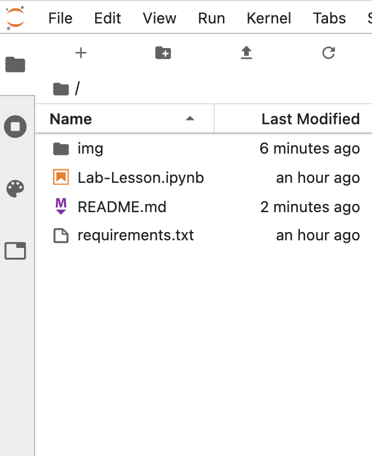
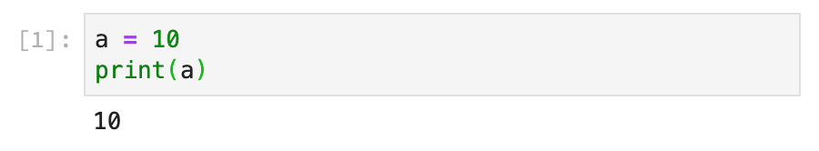

# Introdução ao JupyterHub
Bem-vindo à sessão de tutoriais do HubCMat.

Mais especificamente, aqui estão as principais tecnologias que 
você usará no HubCMat:
* **Python** - Uma linguagem de programação de propósito geral que é fácil de aprender e muito poderosa.
* **JupyterLab** - JupyterLab é um ambiente de desenvolvimento interativo baseado na web para notebooks Jupyter, código e dados.
* **Notebooks Jupyter** - O Notebook Jupyter é um padrão open-source que permite criar e compartilhar documentos que contêm código ativo, equações, visualizações e texto narrativo.
* **JupyterHub** - Uma versão multiusuário do Jupyter rodando em um servidor remoto.
* **SageMath** - 
Aqui vamos usar `sage` para ilustrar o uso do *JupyterLab* para criar, editar e executar *Python* em *Notebooks Jupyter* durante as sessões de laboratório. Executaremos o JupyterLab na instância do [School of Computing and Information](http://sci.pitt.edu) do JupyterHub. Isso significa que você não precisará instalar nenhum software no seu próprio computador, tudo funcionará "na nuvem" e você só precisará de um navegador da web para acessá-lo.

## Visão Geral

O tutotial contemplará essas 5 partes:

1. Acessando o JupyterHub
   * Fazendo login no JupyterHub na Rede UFRPE (Recomendado)
   *  Fazendo login no JupyterHub usando VPN (pode não ser instável)
  
2. Usando o JupyterLab
3. Baixando os materiais do laboratório
4. Introdução aos Notebooks Jupyter
5. Enviando os laboratórios concluídos para o Canvas


## Parte 1 - Acessando o JupyterHub


### O que é o JupyterHub?

O HubCMat é, na verdade, um computador com capacidade computacional avançada somado a um sistema 
de gestão de multiusuários do jupyter chamada Jupyterhub. Ele tem um sistema 
instalado que simplifica o trabalho computacional remoto;
elimina a necessidade de instalar todos os programas individuais para abrir e editar 
os notebooks Jupyter. Isso significa que, independentemente de você estar acessando o hub de um PC, 
Mac ou tablet, você poderá escrever e executar tudo o que precisa no seu notebook. 
Além disso, é muito conveniente ter tudo disponível na nuvem; você poderá acessá-lo de 
qualquer máquina, desde que tenha um navegador e uma conexão à internet.

Outro ponto positivo do uso do JupyterHub é que ele opera em seu próprio sistema de arquivos. 
Isso significa que todos têm um sistema padrão para navegar, simplificando o processo de depuração
e correção de erros.

A desvantagem é que você precisará estar conectado à VPN da UFRPE para acessar os seus arquivos e executar programas  
fora do campus. Felizmente, como muitos de vocês são docentes, basta solicitar o acesso à VPN ao [STD UFRPE](https://digital.ufrpe.br/paginas/secretaria-de-tecnologias-digitais/)!

#### Como fazer login no SCI JupyterHub:

1.  Se você não estiver no Wi-Fi (ou rede cabeada) da UFRPE, conecte-se à VPN. Se precisar de ajuda, as instruções estão [aqui](https://drive.google.com/file/d/1Ir0VnsWClSSZAtqwfF1WBoNKhMr4KvHU/view)
2.  Vá para http://10.9.0.154/.
3.  Faça login com suas credenciais fornecidas pelo administrador do HubCMat
    * Nota: no primeiro acesso, você deve inserir uma senha (escolha pelo menos 8 caracteres). Guarde-a para uso posterior.

[//]: # (4.  Verifique sua identidade com a Autenticação de Dois Fatores)

[//]: # (5.  Clique em `Start my Server`)

[//]: # (6.  Selecione `Host Process` no menu suspenso &#40;deve ser o padrão&#41;, depois clique em `Spawn`)
4. Pronto, você está dentro

[//]: # (Start my Server)

[//]: # (![fazendo login no jupyterhub]&#40;img/hub-login-1.png&#41;)

[//]: # ()
[//]: # (Spawn the Host Process)

[//]: # (![fazendo login no jupyterhub]&#40;img/hub-login-2.png&#41;)

Parabéns! Agora você está logado no JupyterHub. Sua tela deve (esperançosamente) parecer algo assim:



Bem-vindo ao Jupyter Lab!


## Parte 2 - Introdução ao Uso do JupyterLab

[//]: # (Antes de começarmos, assista a este vídeo para uma visão geral básica sobre o uso do JupyterLab para que você possa se familiarizar com seus diferentes recursos.)

[//]: # (* https://www.youtube.com/watch?v=K2Yb1nXTmYM  &#40;Ignore a parte sobre MatrixDS&#41;)

### Criando um Notebook
Os seus códigos serão, principalmente, feitos usando Notebooks Jupyter, 
que permitem que você escreva pedaços de código e/ou markdown de maneira organizada.


### Compreendendo o Sistema de Arquivos
Assim como seu computador tem um sistema de arquivos com uma ordem hierárquica, seus arquivos no JupyterLab são organizados de forma semelhante. Você pode criar pastas para colocar materiais de laboratório e palestras e, depois, colocar pastas dentro de pastas se desejar! Você pode navegar por essas pastas da mesma forma que faria em sua máquina local com o explorador do Windows ou Finder.

Se estiver usando o Jupyterhub do HubCMat, esses arquivos não estão na sua máquina local, eles ficam no JupyterHub. Você pode fazer upload e download de arquivos deste sistema 
de arquivos remoto usando a interface web do JupyterLab.

### O Terminal e o Editor de Texto
O terminal (ou prompt de comando) pode ser útil para várias coisas durante seu trabalho, mas, o principal é a execução de arquivos .py, .sage ou .r. 
Outro bom uso é navegar pelos arquivos e fazer downloads de arquivos do GitHub.
O editor de arquivos de texto é útil para manter informações, como listas e certos dados. 

---

## Parte 3 - Baixando os Materiais e Arquivos do GitHub

Assumindo que você esteja logado no JupyterHub, faça o seguinte:

1. Clique em Arquivo &rarr; Novo &rarr; Terminal.

Deve abrir uma janela parecida com esta

Você deve ver um retângulo piscando - este é o cursor.
2. Copie e cole o seguinte comando:
```shell
git clone https://github.com/ldsufrpe/intro-sage.git
```
Sua janela do terminal deve parecer com esta

3. Pressione enter e aguarde o comando terminar de executar. Depois que isso acontecer, olhe à sua esquerda. Você deve ver uma nova pasta chamada `Intro-to-Jupyter`. Seu explorador de arquivos à direita deve parecer assim


Clique duas vezes na nova pasta. Agora você deve ser capaz de ver os seguintes materiais do laboratório
- `README.md` - o arquivo README que você estava lendo para obter as instruções sobre como acessar o laboratório
- `Lab-Lesson.ipynb` - o arquivo Jupyter Notebook com todos os exercícios que você precisa completar para este laboratório.
- Alguns outros arquivos que você pode ignorar

Seu explorador de arquivos à esquerda deve parecer assim



---

## Parte 4 - Introdução aos Notebooks Jupyter

Um **notebook Jupyter** é uma combinação de código executável, texto formatado e dados brutos.

Um notebook Jupyter é, em sua essência, um monte de *células* em cima de um *kernel* interativo. Esta explicação necessariamente simplifica algumas coisas, mas você pode pensar em cada notebook como tendo seu próprio kernel que todas as suas células podem acessar e modificar. Por exemplo, se você definir `a = 123` em `Notebook1.ipynb`, qualquer célula de código dentro de `Notebook1.ipynb` pode ver o valor de `a`, mas `Notebook2.ipynb` não tem conhecimento da existência da variável `a`. (Para um contraexemplo, tente clicar em "Python 3" no canto superior direito de um notebook quando você estiver no JupyterHub. Divirta-se.)

O kernel específico que estamos usando é uma versão interativa do Python 3 chamada IPython. Essa convenção de nomenclatura se mantém; o kernel julia padrão para o Jupyter é chamado IJulia, por exemplo. Muitas linguagens de programação (incluindo Java) têm kernels interativos para criar notebooks, mas usaremos Python 3 para este tutorial.

### Células

Dentro do notebook Jupyter, há três tipos de células: código, Markdown e bruta. Essas células podem existir em qualquer ordem dentro do notebook e podem ser misturadas e combinadas da maneira que você, o autor, desejar.

**Células de código** são o núcleo da computação do notebook Jupyter. Elas contêm código que é executado pelo kernel. Quando você executa uma célula, quaisquer variáveis que você atribuir serão atribuídas para qualquer célula de código no documento, e qualquer saída que seu código produzir será exibida diretamente abaixo da célula.



**Células Markdown** são a forma padrão de exibir texto rico, tabelas, imagens, GIFs, vídeos e marcação matemática. Markdown é um subconjunto de HTML otimizado para escrever texto rapidamente e, consequentemente, é bastante leve. Por exemplo:

```markdown
# Este É Um Cabeçalho

Aqui está um texto em **negrito**, e aqui está em *itálico*. Posso fazer uma lista assim:

* pontos
* de
* bala
* usam
* asteriscos

1. e
2. listas
3. numeradas
4. usam
5. números :)

Eu também posso [linkar coisas](https://www.pitt.edu) com parênteses e colchetes.

Adicionar uma imagem é como um link:

```

É fácil exibir `código` com crases(\`). Trechos de código mais longos ganham sua própria linha:

```
print("Aqui está um trecho de código mais longo.")
a = 2
b = 3
c = a + b
```

Você pode ver um guia completo de Markdown [aqui](https://github.com/adam-p/markdown-here/wiki/Markdown-Cheatsheet), por enquanto, saiba apenas que você pode escrever textos bonitos em um notebook Jupyter usando células Markdown.

**Células brutas** são o tipo de célula mais simples no Jupyter. Elas contêm apenas dados brutos, não formatados, que não são avaliados nem alterados de nenhuma maneira. Se você quiser incluir pontos de dados brutos ou texto que seja importante exibir como está, as células brutas são a melhor opção. Nós raramente as usaremos neste curso.


